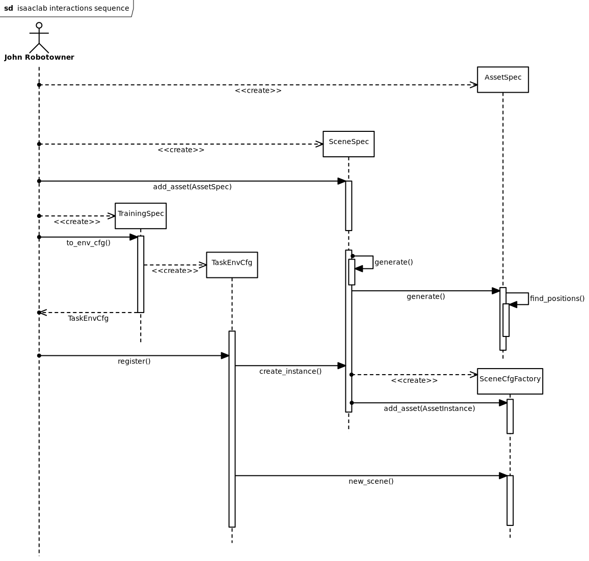

Generating Environments
========================

This is a more hands-on guide to generating environments using STRIPE-kit.
Feel free to reference the actual module documentation for more details, this
is a high level look at modelling environments.

   STRIPE-kit sequence diagram
